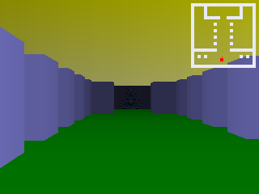
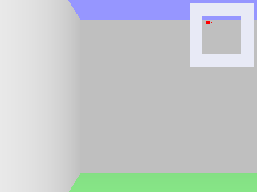
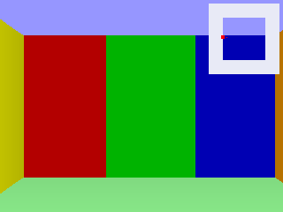
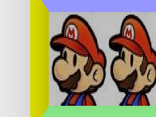

# Raycast Engine

A raycast engine written in TypeScript.

You can play the demo [here](https://games.delarco.com.br/raycast-demo).





## Getting Started

Create a TypeScript project from scratch or using your favorite tool/framework:
```cmd
npm create vite@latest
```

Install the raycats-engine package:
```cmd
npm install git+https://github.com/delarco/raycast-ts.git
```

Create a scene:

```ts
// test-scene.ts
import { RaycastScene } from "raycast-ts";

export class TestScene extends RaycastScene {

    public override preload(): void {

        // create a map from a number array
        this.load.mapFromIntArray([
            1, 1, 1, 1, 1,
            1, 0, 0, 0, 1,
            1, 0, 0, 0, 1,
            1, 0, 0, 0, 1,
            1, 1, 1, 1, 1,
        ], {
            width: 5,
            height: 5
        })
    }
}
```

In the main file (main.ts for Vite), create a game and start the scene:
```ts
// index.ts or main.ts or app.ts or whatever.ts
import { TestScene } from './TestScene.ts'

const game = new Game()
game.start(TestScene)
```

Running, we get something like this:



You can move the camera with:
- Arrow keys;
- WASD keys; and
- Click on the canvas and use the mouse to rotate the camera.

Tiles whith value `0` are not solid and have no collision. Values greater than `0` are walls (solid and collision) and we can set a color:

```ts
// test-scene.ts

/* ... */

this.load.mapFromIntArray([
    1, 1, 1, 5, 1,
    1, 0, 0, 0, 2,
    1, 0, 0, 0, 3,
    1, 0, 0, 0, 4,
    1, 1, 1, 6, 1,
], {
    width: 5,
    height: 5
}, {
    1: Color.WHITE,
    2: Color.RED,
    3: Color.GREEN,
    4: Color.BLUE,
    5: Color.YELLOW,
    6: Color.ORANGE,
})

/* ... */
```



You can also load a map from json files, check the [demo project](https://github.com/delarco/raycast-demo).

To use a texture, load it in the `preload` method and apply in `init` method:

```ts
// test-scene.ts
public override preload(): void {

    /* ... */
    this.load.texture("texture-1", "./texture-file.jpg")
}

public override init(): void {

    for (const tile of this.map.tiles) {
        tile.texture = {
            ...tile.texture,
            [Side.WEST]: this.load.getTexture("texture-1")!
            // each side can have a different texture
        }
    }
}
```




## TODO

* Keymaps
* Animated rectangle (sprites)
* Create an AssetsManager
* Implement a **good** map parser


## Resources

* [Introducing RayCastWorld](https://www.youtube.com/watch?v=Vij_obgv9h4) from [javidx9](https://www.youtube.com/@javidx9)
* [PointerLock](https://web.dev/pointerlock-intro)
* [Material Design - tools-for-picking-colors](https://m2.material.io/design/color/the-color-system.html#tools-for-picking-colors)
